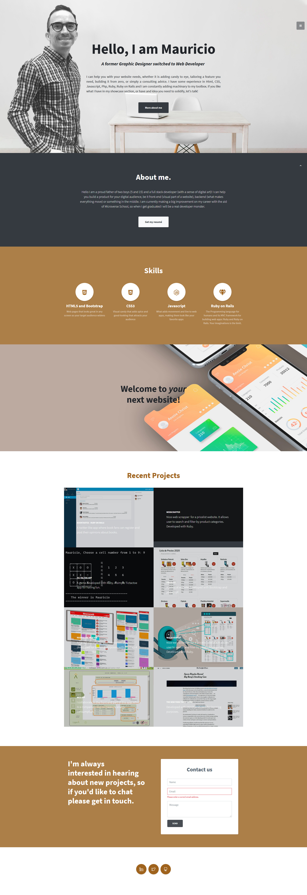

# Portfolio 2020

> My portfolio of web developing works

## Built With

- Bootstrap 4
- HTML 5 and CSS 3
- Javascript for animations
- Photoshop for for retouching images

## Live Demo

[Live Demo Link](http://mauriciosantos.paternit.com)

## Authors

- Github: [@maosan132](https://github.com/maosan132)
- Twitter: [@maosan132](https://twitter.com/maosan132)
- Linkedin: [maurisantos](https://www.linkedin.com/in/mauricsantos)

## 🤝 Contributing

Contributions, issues, and feature requests are welcome!

Feel free to check the [issues page](issues/).

## Show your support

Give a ⭐️ if you like this project!

## Acknowledgments

- Hat tip to anyone whose code was used
- Inspiration
- etc

## 📝 License

This project is [MIT](lic.url) licensed.
